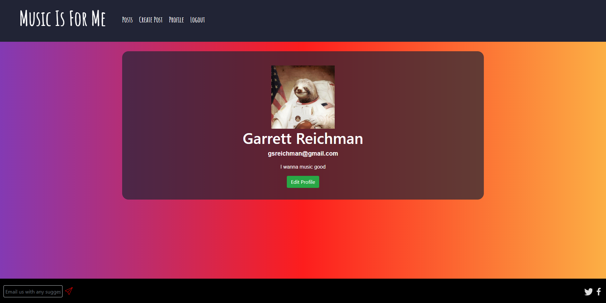
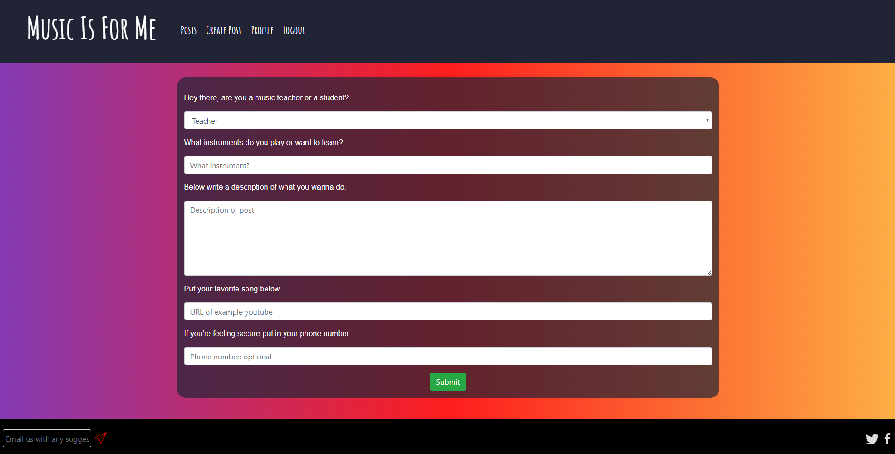
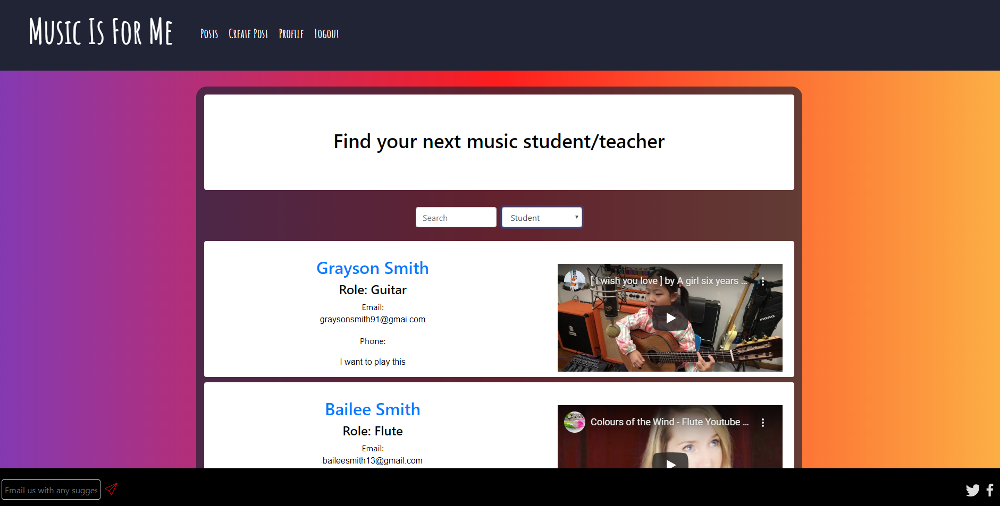

# Music Is For Me
A full-stack web application featuring React, Node, Express and MongoDB built to allow music lovers from all over the world connect to learn music together.

Deployed application: https://music-is-for-me.herokuapp.com/

## Table of Contents 
* [Introduction](#Introduction)
* [Installation](#Installation)
* [How-To](#How-To)
* [Credits](#Credits)
* [License](#License)

---

## Introduction 
Music is for me is an app that connects music students to teachers, coaches, and mentors.  Users can either search for instructors or instructors can connect to new or existing students.  Through the use of Spotify and React Player, API users can identify favorite musical genres or specific songs that the student would like to utilize for musical instruction.

## Installation
*Need Text here*

## How-To
To access the site, visit the link to the deployed application listen above. Once there, create a new account using the form displayed. Once complete, you will be redirected to your newly created profile page. Here you can view your information, edit your name and bio using the edit profile button, and link your spotify to your account using the button below your profile picture(this will require you to log in again once complete).

If you would like to create a new post, click on the Create Post tab on the navbar. This will take you to a form that you can fill out with the details of your post. When you are finished, click the submit button and your post will be added to the database and you will be redirected to the posts page.

To view the posts page, click the Posts tab on the navbar. Here you will initially see a list of every post on the site. Use the dropdown selection to choose if you would like to view posts from teachers or students and use the text input to search for specific topics you wish to teach or learn. Clicking on a post creator's name will let you visit their profile page which will contain their email address if you wish to contact them about their listing. Posts that belong to you will be slightly more dim than posts made by other users.

Gif of the entire process:
https://gyazo.com/bca8c163c5bfb041fa6013be1e1a874c

## Credits
- Garrett Reichman
    * Github - https://github.com/GReichman
- Austin Smith
    * GitHub - https://github.com/Austin-Smith-999
- Rojel C Perez Vez
    * Github - https://github.com/rojel83
- Gus Gonzalez
    * Github - https://github.com/gusgonz

## License

MIT License

Copyright (c) [2020] 

Permission is hereby granted, free of charge, to any person obtaining a copy
of this software and associated documentation files (the "Software"), to deal
in the Software without restriction, including without limitation the rights
to use, copy, modify, merge, publish, distribute, sublicense, and/or sell
copies of the Software, and to permit persons to whom the Software is
furnished to do so, subject to the following conditions:

The above copyright notice and this permission notice shall be included in all
copies or substantial portions of the Software.

THE SOFTWARE IS PROVIDED "AS IS", WITHOUT WARRANTY OF ANY KIND, EXPRESS OR
IMPLIED, INCLUDING BUT NOT LIMITED TO THE WARRANTIES OF MERCHANTABILITY,
FITNESS FOR A PARTICULAR PURPOSE AND NONINFRINGEMENT. IN NO EVENT SHALL THE
AUTHORS OR COPYRIGHT HOLDERS BE LIABLE FOR ANY CLAIM, DAMAGES OR OTHER
LIABILITY, WHETHER IN AN ACTION OF CONTRACT, TORT OR OTHERWISE, ARISING FROM,
OUT OF OR IN CONNECTION WITH THE SOFTWARE OR THE USE OR OTHER DEALINGS IN THE
SOFTWARE.

## Badges

